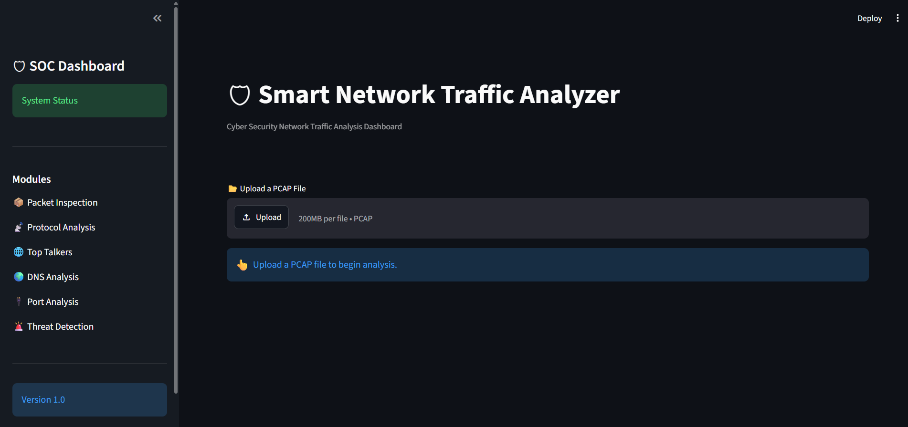

# 🛡 Smart Network Traffic Analyzer

A Python-based cybersecurity project that analyzes network traffic from PCAP files using **Scapy** and presents the results through an interactive **Streamlit SOC Dashboard**.

---

## 📌 Features

* 📦 Packet Inspection
* 📊 Protocol Analysis
* 🌐 Top Talkers Analysis
* 🌍 DNS Traffic Analysis
* 🔌 Port Analysis
* 🚨 Threat Detection
* 📈 Risk Score Calculation
* 💡 Security Recommendations
* 📂 Upload Any PCAP File
* 🌙 Interactive Streamlit Dashboard

---

## 🛠 Technologies Used

* Python
* Scapy
* Streamlit
* Pandas
* Plotly
* Matplotlib

---

## 📂 Project Structure

```
Network Analyzer/
│
├── dashboard.py
├── main.py
│
├── analysis/
│   ├── packet_inspection.py
│   ├── protocol_analysis.py
│   ├── top_talkers.py
│   ├── dns_analysis.py
│   ├── port_analysis.py
│   └── threat_detector_v2.py
│
├── components/
│   ├── sidebar.py
│   ├── header.py
│   ├── footer.py
│   ├── kpi_cards.py
│   ├── protocol_chart.py
│   ├── packet_table.py
│   ├── top_talkers_panel.py
│   ├── dns_panel.py
│   ├── port_panel.py
│   └── threat_panel.py
│
├── sample_pcaps/
├── uploads/
├── reports/
├── requirements.txt
└── README.md
```

---

## 🚀 Installation

Clone the repository:

```bash
git clone https://github.com/yourusername/network-analyzer.git
```

Install the required libraries:

```bash
pip install -r requirements.txt
```

Run the application:

```bash
python -m streamlit run dashboard.py
```

---

## 📖 Usage

1. Launch the Streamlit dashboard.
2. Upload any `.pcap` file.
3. Click **Analyze Network**.
4. View protocol statistics, packet inspection, DNS analysis, port analysis, top talkers, threat detection, and risk assessment.

---

## 🔍 Threat Detection

The analyzer detects:

* FTP Traffic
* Telnet Traffic
* ICMP Flood
* DNS Flood
* Port Scanning

---


## Dashboard Preview



---

## 👨‍💻 Author

**Aditya Gireesh Pillai**

B.Tech Computer Engineering

Cybersecurity & Cloud Computing

Mumbai University
